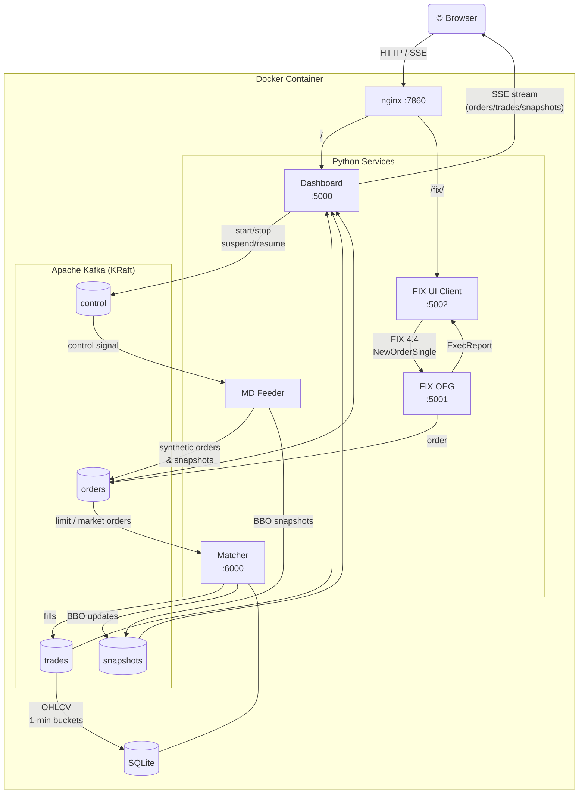

# StockEx – Kafka-based Stock Exchange Simulator

A real-time stock exchange simulation built with **Apache Kafka**, **Python**, and **Flask**.
Includes a FIX 4.4 order gateway, live matching engine, SSE-streamed dashboard, and candlestick charts.

🔗 **Live demo:** [huggingface.co/spaces/RayMelius/StockEx](https://huggingface.co/spaces/RayMelius/StockEx)
📦 **Source:** [github.com/Bonum/StockEx](https://github.com/Bonum/StockEx)

---

## Architecture Overview

```
┌─────────────────────────────────────────────────────────────────┐
│                   Single Docker Container                       │
│                                                                 │
│   nginx :7860 (reverse proxy)                                   │
│       /      → Dashboard  :5000                                 │
│       /fix/  → FIX UI     :5002                                 │
│                                                                 │
│  ┌─────────────┐   ┌──────────────┐   ┌───────────────────┐    │
│  │  MD Feeder  │   │  FIX OEG     │   │  FIX UI Client    │    │
│  │ (simulator) │   │  :5001       │   │  Flask :5002      │    │
│  └──────┬──────┘   └──────┬───────┘   └─────────┬─────────┘    │
│         │                 │                       │ FIX 4.4     │
│         │    ┌────────────┘                       │             │
│         ▼    ▼                                    │             │
│  ┌─────────────────────────────────────────────┐  │             │
│  │            Apache Kafka (KRaft)             │  │             │
│  │  orders │ trades │ snapshots │ control      │  │             │
│  └──────────────────┬──────────────────────────┘  │             │
│                     │                              │             │
│         ┌───────────┘                              │             │
│         ▼                                          │             │
│  ┌─────────────┐   ┌──────────────────────────┐   │             │
│  │   Matcher   │   │  Dashboard Flask :5000   │◄──┘             │
│  │  Flask:6000 │   │  SSE + REST API          │                 │
│  │  SQLite DB  │   │  SQLite OHLCV history    │                 │
│  └─────────────┘   └──────────────────────────┘                 │
└─────────────────────────────────────────────────────────────────┘
```

---

## Message Flow



---

## Services

| Service | Port | Description |
|---|---|---|
| **nginx** | 7860 | Reverse proxy — single public port |
| **Dashboard** | 5000 | Flask app, SSE streaming, session control, OHLCV history |
| **Matcher** | 6000 | Price-time priority matching engine, REST API, SQLite persistence |
| **MD Feeder** | — | Synthetic market data generator; responds to start/stop/suspend/resume |
| **FIX OEG** | 5001 | FIX 4.4 acceptor — translates FIX messages to Kafka orders |
| **FIX UI Client** | 5002 | Browser UI for sending FIX orders and viewing execution reports |

---

## Features

- **Live Order Book** — best bid/ask with full depth per symbol
- **Trade Feed** — real-time executions pushed via Server-Sent Events
- **Market Snapshot** — BBO table + scrolling ticker tape
- **Price Chart** — candlestick + close-price line + volume bars; Live / 1H / 8H / 1D / 1W / 1M periods
- **All-Symbols View** — normalised % change chart comparing all securities on one axis
- **Trading Statistics** — per-symbol trade count, volume, value, VWAP, bar chart
- **Start / End of Day** — resets opening prices, starts/stops MD simulation
- **Suspend / Resume** — pauses order generation without ending the session
- **Order Management** — cancel and amend resting orders from the dashboard
- **FIX UI Client** — send NewOrderSingle via FIX 4.4, view execution reports at `/fix/`
- **Mobile Responsive** — single-column layout on phones and tablets

---

## Securities

| Symbol | Name | Start Price |
|---|---|---|
| ALPHA | Alpha Bank | €24.95 |
| PEIR | Piraeus Bank | €18.05 |
| EXAE | Athens Exchange Group | €42.05 |
| QUEST | Quest Holdings | €12.60 |
| NBG | National Bank of Greece | €18.05 |
| ATTIKA | Attika Bank | €3.95 |
| INTKA | Intertech | €3.95 |
| LAMDA | Lamda Development | €3.95 |
| AEG | AEG | €3.95 |
| AAAK | AAAK | €3.95 |

---

## Stack

- **Apache Kafka 3.7** (KRaft mode — no ZooKeeper)
- **Python 3.11** · Flask 2.2 · kafka-python 2.0
- **QuickFIX** (FIX 4.4 protocol, compiled from C++)
- **SQLite** — matcher order/trade persistence + OHLCV history
- **Canvas 2D API** — candlestick charts rendered client-side
- **Server-Sent Events** — real-time push to browser (no WebSocket)
- **nginx** — reverse proxy with `sub_filter` URL rewriting for `/fix/`

---

## Deployment

### Option 1 — Use the live HuggingFace Space (zero setup)

Open: **https://huggingface.co/spaces/RayMelius/StockEx**

No account or installation required.

---

### Option 2 — Deploy your own HuggingFace Space

> Pushes to your GitHub `main` branch auto-deploy to HuggingFace via GitHub Actions.

**Step 1 — Fork the repository**

```bash
# On GitHub: click Fork on https://github.com/Bonum/StockEx
```

**Step 2 — Create a HuggingFace Space**

1. Go to [huggingface.co/new-space](https://huggingface.co/new-space)
2. Choose **Docker** SDK
3. Set `App port` to `7860`
4. Note your Space URL: `https://huggingface.co/spaces/<your-username>/StockEx`

**Step 3 — Get a HuggingFace write token**

1. Go to [huggingface.co/settings/tokens](https://huggingface.co/settings/tokens)
2. Create a token with **Write** permission
3. Copy the token (starts with `hf_…`)

**Step 4 — Add the token as a GitHub Secret**

1. In your fork: **Settings → Secrets and variables → Actions**
2. Click **New repository secret**
3. Name: `HF_TOKEN` · Value: your token from Step 3

**Step 5 — Update the Space URL in the workflow** *(if your username differs)*

Edit `.github/workflows/deploy-hf.yml`:
```yaml
git remote add huggingface https://<your-hf-username>:${HF_TOKEN}@huggingface.co/spaces/<your-hf-username>/StockEx.git
```

**Step 6 — Push**

```bash
git push origin main
```

GitHub Actions runs the CI tests, then pushes to HuggingFace. The Space builds (~5–15 min on first run due to QuickFIX compilation) and goes live automatically on every subsequent push.

---

### Option 3 — Local with Docker Compose

**Prerequisites:** Docker Desktop

```bash
git clone https://github.com/Bonum/StockEx.git
cd StockEx
docker-compose up
```

| URL | Service |
|---|---|
| http://localhost:5000 | Trading Dashboard |
| http://localhost:5001 | FIX OEG (TCP, not HTTP) |
| http://localhost:5002 | FIX UI Client |
| http://localhost:6000 | Matcher REST API |

---

### Option 4 — Local without Docker

**Prerequisites:** Python 3.11+, Apache Kafka running on `localhost:9092`

```bash
git clone https://github.com/Bonum/StockEx.git
cd StockEx
pip install kafka-python Flask requests quickfix

# In separate terminals:
export PYTHONPATH=$(pwd)
export KAFKA_BOOTSTRAP=localhost:9092
export MATCHER_URL=http://localhost:6000

python matcher/matcher.py          # terminal 1
python md_feeder/mdf_simulator.py  # terminal 2
python dashboard/dashboard.py      # terminal 3
```

Then open http://localhost:5000.

---

## CI / CD

| Trigger | Action |
|---|---|
| Push to `main` | Run matcher unit tests + Docker build check |
| Push to `main` (tests pass) | Auto-deploy to HuggingFace Spaces |
| Pull request to `main` | Run tests only |

GitHub Actions workflows: `.github/workflows/ci.yml` · `.github/workflows/deploy-hf.yml`

---

## Project Structure

```
StockEx/
├── matcher/            # Matching engine + SQLite persistence
├── md_feeder/          # Synthetic market data generator
├── dashboard/          # Flask dashboard + SSE + OHLCV history
│   └── templates/      # Single-page trading UI
├── fix_oeg/            # FIX 4.4 Order Entry Gateway
├── fix-ui-client/      # FIX browser UI
├── shared/             # Shared config + Kafka utils
├── shared_data/        # securities.txt (symbol list + prices)
├── Dockerfile          # HuggingFace / single-container build
├── docker-compose.yml  # Local multi-container dev setup
├── entrypoint.sh       # Container startup (Kafka → services → nginx)
├── kafka-kraft.properties
└── nginx.conf          # Reverse proxy config
```
