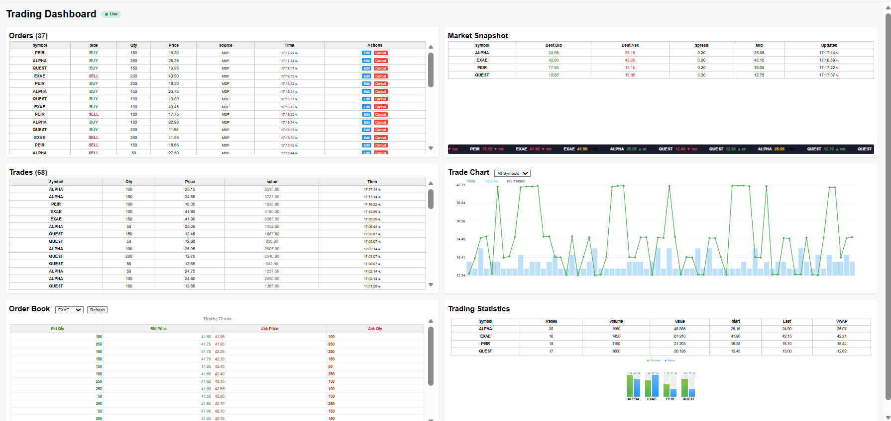

# StockEx — Euronext/OPTIQ Trading System Emulator

## Overview

**StockEx** is a real-time trading simulation platform inspired by Euronext OPTIQ. It provides a complete order flow from FIX protocol entry through matching engine to trade execution, with live visualization via a web dashboard.

## Architecture

| Component | Description |
|-----------|-------------|
| **FIX OEG** | QuickFIX acceptor receiving FIX 4.4 orders |
| **Kafka** | Message backbone (topics: `orders`, `snapshots`, `trades`) |
| **Matcher** | Order matching engine with price-time priority |
| **MDF** | Market Data Feeder publishing BBO snapshots |
| **Dashboard** | Real-time web UI with SSE streaming |

## Data Flow

```
FIX Client → FIX OEG → Kafka [orders] → Matcher → Kafka [trades]
                                            ↓
MDF → Kafka [snapshots] ───────────→ Dashboard (Flask)
```

## Dashboard Features

- **Orders Panel** — Live order feed with Edit/Cancel actions
- **Market Snapshot** — Best Bid/Ask with spread, mid price, and scrolling ticker
- **Trades Panel** — Executed trades with value calculation
- **Order Book** — Depth of book per symbol (bids/asks)
- **Trade Chart** — Price and volume visualization
- **Trading Statistics** — Volume, Value, VWAP per symbol with bar charts



## Quick Start

```bash
docker compose up --build
```

Open dashboard: **http://localhost:5005**

## Directory Structure

```
StockEx/
├── docker-compose.yml
├── fix_oeg/          # FIX Order Entry Gateway
├── fix-ui-client/    # FIX test clients
├── matcher/          # Order matching engine
├── md_feeder/        # Market data simulator
├── dashboard/        # Flask web dashboard
├── frontend/         # Manual order entry UI
├── shared/           # Common config and utilities
└── shared_data/      # Securities and state files
```

## Configuration

| Variable | Default | Description |
|----------|---------|-------------|
| `KAFKA_BOOTSTRAP` | kafka:9092 | Kafka broker address |
| `TICK_SIZE` | 0.05 | Minimum price increment |
| `ORDERS_PER_MIN` | 8 | MDF order generation rate |

## Requirements

- Docker & Docker Compose
- Ports: 5005 (Dashboard), 6000 (Matcher), 9092 (Kafka)

---
*StockEx v1.0 — Trading Simulation Platform*
